<h1 align="center">Kunyu Xu (Yuki)</h1>

  

  
  
  

  <code>agent evaluation</code> ·
  <code>grounded generation</code> ·
  <code>local-first safety</code> ·
  <code>developer experience</code>

I build AI agents, evaluation systems, and developer tools that turn LLM demos
into measurable delivery decisions. At Thoughtworks, I work across TypeScript,
React, Node.js, Python, and Java/Spring Boot—from prototypes and eval harnesses
to production workflows.

## `01 / live metrics`

  
  

## `02 / systems, not demos`

<table>
  <tr>
    <td width="50%" valign="top">
      <h3><a href="https://github.com/yuki-uix/pace-triage-agent">🧪 pace-triage-agent</a></h3>
      
Insurance enquiry triage and reply drafting with a frozen golden set, human review queue, and 2×2 evaluation matrix.

      
<strong>The useful result:</strong> every tested configuration missed the safety bars, producing a defensible no-ship decision.

      
      
    </td>
    <td width="50%" valign="top">
      <h3><a href="https://github.com/yuki-uix/RepoCoach">🛰️ RepoCoach</a></h3>
      
A source-learning agent with constructive grounding, complete exit-path safety gates, and measured agent-loop economics.

      
<strong>Validated:</strong> agent-loop economics and exit-path safety across 638 tests and 22 merged PRs, with the findings turned into reusable engineering guidance.

      
      
    </td>
  </tr>
  <tr>
    <td width="50%" valign="top">
      <h3><a href="https://github.com/yuki-uix/rag-generative-ui-explorer">🧭 RAG Generative UI Explorer</a></h3>
      
Grounded evidence becomes schema-constrained, interactive knowledge cards—not arbitrary model-generated UI code.

      
<strong>Measured:</strong> dense retrieval reached 63.7% Recall@10 versus 47.6% for BM25; fusion did not beat the best single retriever.

      
      
    </td>
    <td width="50%" valign="top">
      <h3><a href="https://github.com/yuki-uix/agent-cost-lab">⚡ agent-cost-lab</a></h3>
      
A measurement lab for the uncomfortable fact that fewer tokens can still mean a larger bill when cache economics change.

      
<strong>First result:</strong> one compaction paid back after 18–19 turns, not the 2–4 turns predicted before measurement.

      
      
    </td>
  </tr>
</table>

  <a href="https://github.com/yuki-uix/agent-eval-harness"><code>agent-eval-harness</code></a>
  &nbsp;•&nbsp;
  <a href="https://github.com/yuki-uix/pr-review-agent"><code>pr-review-agent</code></a>
  &nbsp;•&nbsp;
  <a href="https://github.com/yuki-uix/beforeshare"><code>beforeshare</code></a>

## `03 / measured impact`

<table>
  <tr>
    <td align="center"><strong>≈90% less time</strong> multi-market rollout setup</td>
    <td align="center"><strong>1,018 KB → 92 KB</strong> evaluation worker bundle</td>
    <td align="center"><strong>31 HTTP tests</strong> integration coverage</td>
    <td align="center"><strong>Top 3 · APAC</strong> Thoughtworks AI/works challenge</td>
  </tr>
</table>

- Built a project-wide AI code review platform that runs on every PR across
  multiple TypeScript repositories; it caught a runtime crash missed by ESLint
  and AI-generated tests.
- Built and piloted an agent-configuration evaluation engine with two delivery
  teams, including a human-in-the-loop improvement cycle.
- Encoded multi-market rollout knowledge into a reusable coding-agent workflow,
  reducing setup from roughly one week to half a day.

## `04 / latest writing`

Fresh notes on AI delivery, design engineering, and the parts of software that
only become visible after the demo works.

<!-- BLOG-POST-LIST:START -->
- `2026-08-27` — [We Can Build an Agent in Ten Minutes — Why Does Shipping It Still Take Weeks?](https://www.yukiuix.com/en/writing/agent-demo-to-delivery)
- `2026-05-31` — [Reading baoyu-skills Source Code Through a Design Systems Lens — Three Familiar Patterns](https://mp.weixin.qq.com/s/YSckbphLlJbh6DMwzplLXg)
- `2026-05-28` — [I Thought All 9 Token Styles Were Valid — Until I Changed the IA](https://dev.to/yuki-uix/built-a-token-switcher-with-9-profiles-they-all-worked-that-made-me-ask-questions-2f6a)

<!-- BLOG-POST-LIST:END -->

  <a href="https://www.yukiuix.com/en/writing">Read the full archive →</a>

## `05 / contribution city`

  

<picture>
  <source
    media="(prefers-color-scheme: dark)"
    srcset="https://raw.githubusercontent.com/yuki-uix/yuki-uix/output/github-contribution-grid-snake-dark.svg"
  />
  <source
    media="(prefers-color-scheme: light)"
    srcset="https://raw.githubusercontent.com/yuki-uix/yuki-uix/output/github-contribution-grid-snake.svg"
  />
  
</picture>

## `06 / toolbox`

  

  <strong>AI engineering:</strong> Agent evaluation · RAG / embeddings · MCP · LLM APIs · Prompt / Skill Engineering 
  <strong>Product engineering:</strong> TypeScript · React · Next.js · Node.js · Hono · Python · Java · Spring Boot 
  <strong>Delivery:</strong> Azure DevOps · CI/CD · Google Cloud · Playwright · Honeycomb

  
<strong>Why architecture still matters to my engineering</strong>

   
  I studied architecture before I wrote code. It trained me to see software as
  a system people move through—not just a set of screens—and still shapes how I
  design agent interactions, failure paths, and developer tools.

 

  <a href="https://www.yukiuix.com/">Portfolio</a> ·
  <a href="https://juejin.cn/user/3582625834347100">Juejin</a> ·
  <a href="https://www.linkedin.com/in/kunyu-xu/">LinkedIn</a> ·
  <a href="https://dev.to/yuki-uix">Dev.to</a>

  

